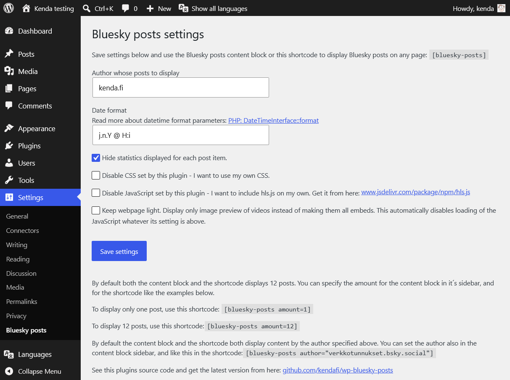
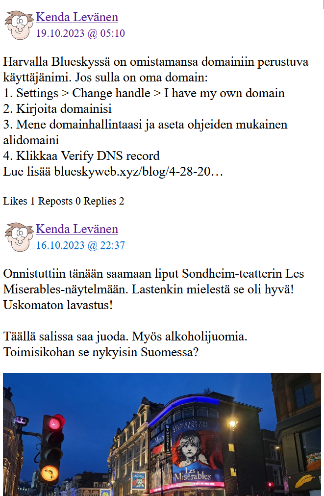

# Bluesky posts WordPress plugin

This enables a content block and a shortcode that outputs a specific user´s Bluesky posts based on set settings.

	[bluesky-posts]

It displays a specific user´s original posts only. Replies and re-posts are skipped.

By default it displays 12 posts. You can specify this in the content block sidebar.

Or with attribute `amount` in the shortcode if you use that.
For example to display only one post, use this shortcode.

	[bluesky-posts amount=1]

You can set a default username in Settings > Bluesky posts, but you can override
it in the content block sidebar. This allows you to add multiple user´s feeds to the same page.

Here is an example how to specify the author in the shortcode.

	[bluesky-posts author="verkkotunnukset.bsky.social" amount=12]

The plugin has some basic CSS, but it should use your site´s font and color for the text.
You can turn off the plugin CSS if you want to style it completely yourself.

The plugin stores fetched content into transients. This means we ping Bluesky
only once every 10 minutes to avoid exceeding any connection limits.

## Install

Clone [this repository](https://github.com/kendafi/wp-bluesky-posts)
or download as a [ZIP file](https://github.com/kendafi/wp-bluesky-posts/archive/refs/heads/main.zip).

Go to your WP admin > Plugins page and click on the Add New Plugin button.

Click on Upload Plugin button, and then on the Browse button to select the ZIP file.

Activate the plugin.

Go in WP admin to Settings > Bluesky post. Enter the account which posts you want to display by default. Save settings.

Go to any page and add either the Bluesky posts content block or the shortcode `[bluesky-posts]` to its content.

If you need to add the Bluesky content block to any allowed blocks setting, its name is `kenda/bluesky`.

## Videos

Videos come as playlists. A JavaScript library that implements an HTTP Live Streaming client
is required for playlists to work in all modern browsers (some support it by default).
This plugin adds `hls.js` into your `<head>`.
It is loaded from [www.jsdelivr.com/package/npm/hls.js](https://www.jsdelivr.com/package/npm/hls.js)
where you can read more about `hls.js`.

You can also download a copy of it if you want to host it on your websites server.
In this case you should disable loading the JavaScript from the CDN - do this
on the plugin settings page in WP admin > Settings > Bluesky posts.

If you want to keep your webpage fast you may want to only display images
instead of the whole video embed that also requires that heavy JavaScript library mentioned above.
You can select this option on the plugin settings page.

## Screenshots

