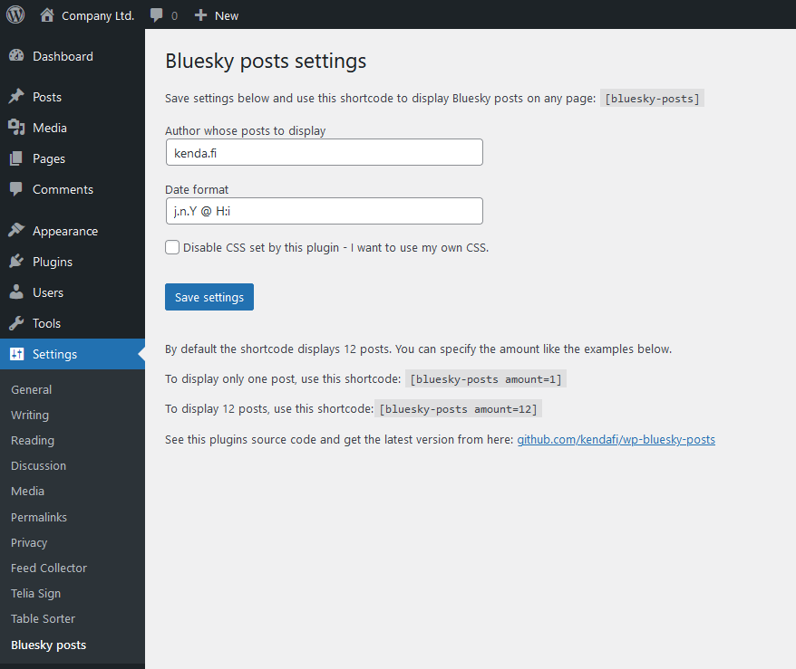
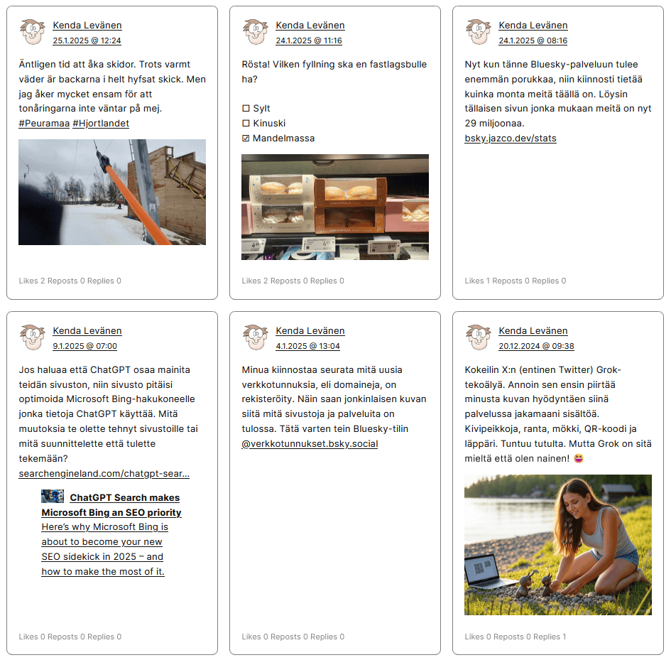

# Bluesky posts WordPress plugin

This enables a WordPress shortcode which displays posts from Bluesky according to your settings.

	[bluesky-posts]

It displays a specific users original posts only. Replies and re-posts are skipped.

By default it displays 12 posts. You can specify this with attribute `amount`.
For example to display only one post, use this shortcode.

	[bluesky-posts amount=1]

The plugin has some basic CSS, but it should use your sites font and color for the text.
You can turn off the plugin CSS if you want to style it completely yourself.

## Preparations

You will need a Bluesky app password.

Create your APP password here: [bsky.app/settings/app-passwords](https://bsky.app/settings/app-passwords)

## Install

Download this repository as a ZIP file from [github.com/kendafi/wp-bluesky-posts](https://github.com/kendafi/wp-bluesky-posts) by clicking on the green Code button and selecting Download ZIP.

Go to your WP admin > Plugins page and click on the Add New Plugin button.

Click on Upload Plugin button, and then on the Browse button to select the ZIP file.

Activate the plugin.

Go in WP admin to Settings > Bluesky post. Enter your username, your app password, and the account which posts you want to display. Save settings.

Go to any page and add the shortcode `[bluesky-posts]` to its content.

## Screenshots

